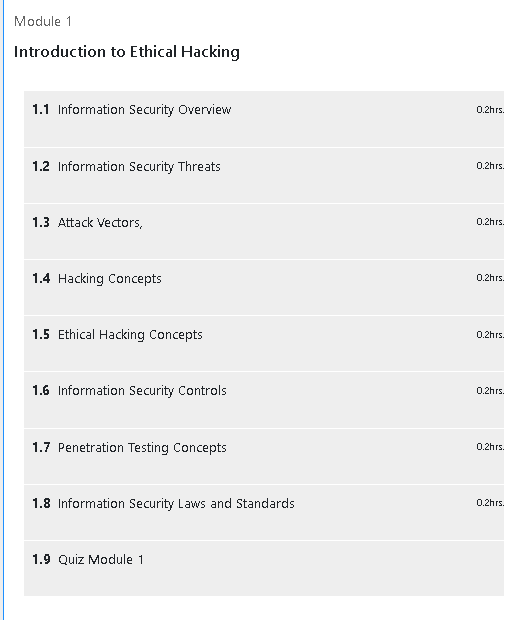
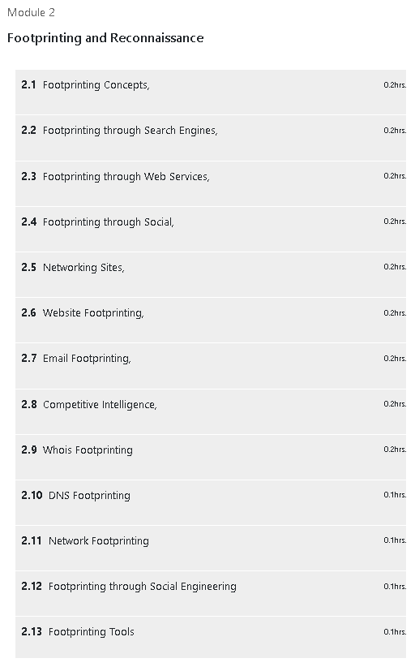

# 🛡️ Ethical Hacking – Henry Harvin Education

This repository documents my learning journey from the **Ethical Hacking** course offered by [Henry Harvin Education](https://www.henryharvin.com/courses/ethical-hacking-course), including:

- Structured notes by topic
- A hands-on demo walkthrough
- Threat analysis and strategic documentation
- Visual screenshots from the learning portal

---

## 📜 Certificate

- 📄 [`henryharvin-ethical-hacking-certificate.pdf`](./cert/henryharvin-ethical-hacking-certificate.pdf)

---

## 📚 Course Notes

Organized by module, covering key foundational and intermediate concepts in ethical hacking.

- 📘 [`network-scanning.md`](./notes/network-scanning.md)
- 📘 [`system-hacking.md`](./notes/system-hacking.md)
- 📘 [`web-app-attacks.md`](./notes/web-app-attacks.md)
- 📘 [`wifi-hacking-basics.md`](./notes/wifi-hacking-basics.md)
- 📘 [`countermeasures.md`](./notes/countermeasures.md)

---

## 💻 Demo Lab

A complete, realistic attack chain simulation.

- ⚔️ [`attack-chain-simulation.md`](./demo/attack-chain-simulation.md)

---

## 🧠 Strategic Insights

Tactical and analytical documents reflecting real-world frameworks.

- 📌 [`phases-of-ethical-hacking.md`](./strategy/phases-of-ethical-hacking.md)
- 🔍 [`threat-modeling-overview.md`](./analysis/threat-modeling-overview.md)

---

## 🖼️ Screenshots

| Title             | Image |
|------------------|-------|
| 🏁 Welcome Page   |  |
| 🧩 Module 1       |  |
| 🧠 Module 2       |  |

---

## 📝 Course Review

This course offers a practical overview of ethical hacking tools, phases, and tactics. Though designed for beginners, it still touches on relevant techniques used by modern Red Team professionals.

✅ **What I liked**:
- Broad coverage of both network and application attacks  
- Simple language and beginner-friendly structure  
- Includes both theory and some practice-oriented examples

📌 **To Improve**:
- Lack of true lab environments or VM practice  
- Some sections could use updated tools or attack chains

---

## 🧾 Disclaimer

All materials provided in this repository are for **educational purposes only**.  
By accessing or using any file within, you agree:

- Not to apply any technique to unauthorized systems  
- That the author holds no responsibility for your misuse  
- To use this content ethically, legally, and within boundaries of **responsible disclosure**

See [`DISCLAIMER.md`](./DISCLAIMER.md) for full disclaimer.

---

## 🤝 Code of Conduct

We aim to foster a respectful, inclusive, and harassment-free learning environment.  
Please see our [`CODE_OF_CONDUCT.md`](./CODE_OF_CONDUCT.md) for expected behavior and reporting procedures.

---

## ✍️ Author

**Thành Danh** – Pentester & Cybersecurity Researcher  
GitHub: [@ngvtdanhh](https://github.com/ngvtdanhh)  
Email: ngvu.thdanh@gmail.com

---

## 📄 License

This project is licensed under the **GNU AGPL v3.0**  
See [`LICENSE`](./LICENSE) for details.

© 2025 ngvtdanhh. All rights reserved.
